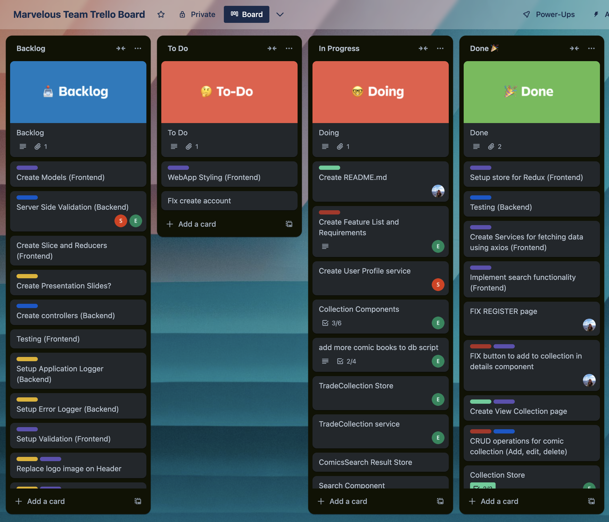
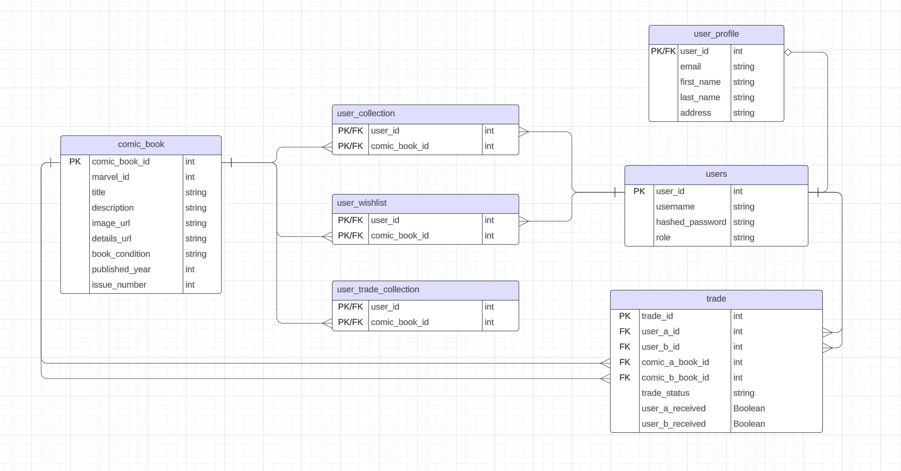
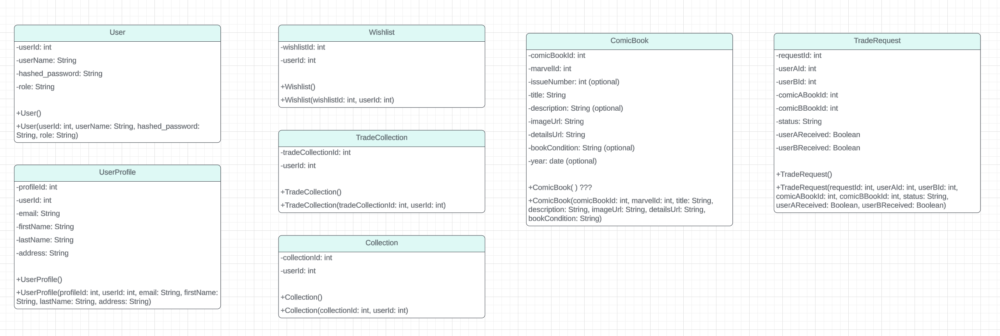
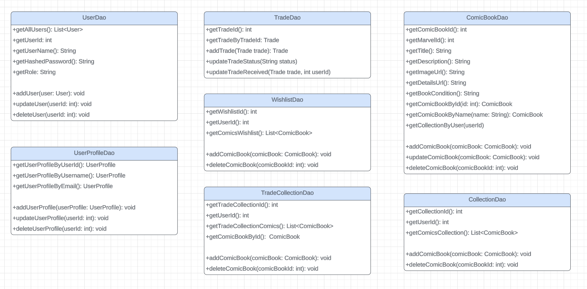
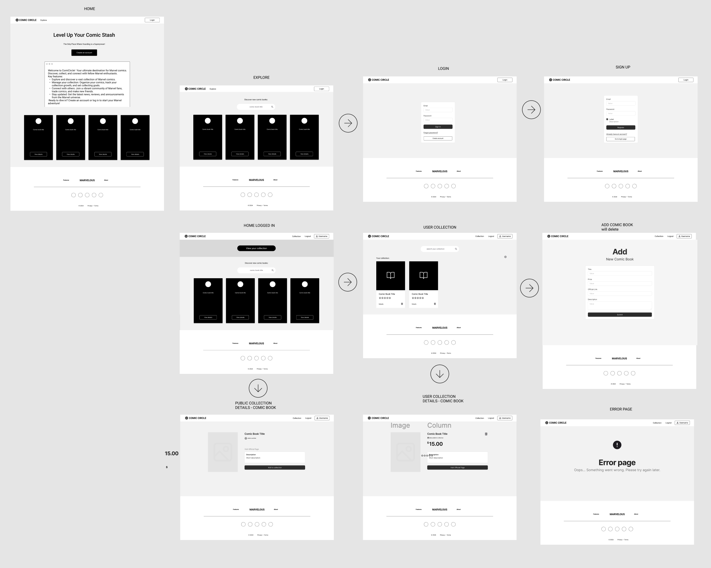

# Comic Circle

## Project Overview

**Comic Circle** is a dynamic platform that allows comic book enthusiasts to manage their collections and engage in comic trading with other users. Leveraging Marvel API, the app enhances the comic collecting experience by importing and displaying rich comic data, making it easy for users to track, showcase, and expand their collections. Additionally, Comic Circle's wishlist and trading features enable collectors to find new comics and connect with others to arrange trades, helping to build a vibrant community of comic book lovers.

With Comic Circle, we're not just organizing collections—we're fostering a collaborative, passionate community of collectors, making it easier for fans to discover, trade, and celebrate their favorite stories and characters.

## Key Features
- **Collection Management**: Organize and manage your personal comic book collection with ease.
- **Trading System**: Connect with other users and arrange trades to expand your collection.
- **Wishlist**: Keep track of the comics you're looking for, and let other users know what you're after.
- **Search Functionality**: Search the public API for comic books to add them to your collection or wishlist.

## Technologies Used
- **Frontend**: React, Redux, TypeScript, Vite
- **Backend**: Java, Spring Boot, MySQL
- **Other Tools**: IntelliJ, VSCode, Git
- **Architecture**: Model-View-Controller (MVC)

## Setup Instructions

To run Comic Circle locally:

1. **Clone the Repository**:
   ```bash
   git clone https://github.com/full-stack-devs-learn/niantic-2024-final-capstone-comic-book.git
   cd niantic-2024-final-capstone-comic-book
   ```

2. **Backend Setup**:
    - Make sure you have MySQL installed.
    - Create a MySQL database named comic_circle_db.
    - Update the database configuration in application.properties with your database credentials.
    - Run the backend service using your preferred IDE (e.g., IntelliJ).


3. **Frontend Setup**:
    - Install dependencies
    ```bash
    npm install
    ```
    - Run the development server
    ```bash
    npm run dev
    ```
    - Open your browser and navigate to http://localhost:{port} to interact with the app.

## Usage
Once the application is running, you can:

- **Register** and **Login** to manage your comic collection.

- Use the **search feature** to explore new comics via the Marvel API and add them to your collection or wishlist.

- Access your **wishlist** and **trade** comics with other users.

- **Organize** and **manage** your collection using the intuitive UI.

## Development Process

### Project Planning
We kicked off development by defining the core features and user stories through a collaborative brainstorming session. The project was managed using a Trello Kanban board, where tasks were prioritized and assigned to ensure smooth workflow. This gave us visibility into each stage of development and allowed us to adjust the scope when necessary. Below is a screenshot of our Trello board:



### Database, Models, and Services
We designed the application using the MVC pattern to separate concerns effectively. The database was modeled in MySQL, and we created comprehensive diagrams to outline our structure, showing how collections, trades, and users are interconnected. Here are the visual representations of our database schema and services:

#### Database


#### Models


#### Services


### Wireframe
We created a wireframe to visualize the application's structure and user interface before diving into the development phase. The wireframe served as a blueprint for the design and functionality.



### Agile Practices
We applied Agile methodologies by working in short development sprints. Daily stand-ups and weekly retrospectives helped us stay on track and continuously improve the product.

## Challenges, Approach, and Solutions

### Elena Bychenkova
#### Challenge:  
Managing collections in our comic book app, making sure users can move books between collections smoothly and edit book details without issues.

#### Solution:
We used Redux Toolkit to handle adding, removing, and editing books in different collections. Redux Toolkit helps us manage state and asynchronous actions efficiently. By dispatching actions, we ensure our app runs smoothly and looks great.

#### Code I'm Proud of: 
This snippet shows how we handle moving a book from the trade collection back to the main collection and editing book conditions directly in the UI
```tsx
  const handleMoveToTrade = async (event: React.MouseEvent<SVGElement, MouseEvent>) => {
    event.stopPropagation();
    const result = await dispatch(addComicBookToUserTradeCollection(book));
    if (result.type === 'comics/trade-collection/add/fulfilled') {
      dispatch(removeComicBookFromCollection(book.comicBookId));
    }
  }
```

#### Backend:  
We used transactions to ensure data consistency during database operations. If something went wrong while moving a comic book, the previous actions would be undone to keep our data safe. Here’s a snippet demonstrating the use of @Transactional:
```Java
@Transactional
    public ComicBook addComicBookToUserTradeCollection(int comicBookId, int userId) {
        ComicBook comicBook = getComicBookById(comicBookId);
        if (comicBook == null) {
            return null;
        }

        String sql = """
                INSERT INTO user_trade_collection
                (user_id, comic_book_id)
                VALUES (?, ?);
                """;

        jdbcTemplate.update(sql, userId, comicBookId);

        sql = """
                DELETE FROM user_collection
                WHERE user_id = ?
                AND comic_book_id = ?;
                """;

        jdbcTemplate.update(sql, userId, comicBookId);

        return comicBook;
    }
```

### Dureti Shemsi

#### Challenge:
#### Solution:
#### Code I'm Proud of:


### Chin Antalan

#### Challenge:
The Marvel API we used for comic data often return too much data or introduced unexpected delays. I had to match the API calls from both Marvel API and our database while minimizing delays.
#### Solution:
I used props to pass important data to child component to avoid another API call, improving performance and ensuring a smoother user experience. I also used async await and try catch blocks to avoid issues from delays.
#### Code I'm Proud of:
```tsx
export default function Details(this: any, { title, description, photoUrl, comicId }: any) {
    const dispatch = useAppDispatch()
    const { isAuthenticated } = useSelector((state: RootState) => state.authentication);
    const [isInCollection, setIsInCollection] = useState(false);
    const [isInWishlist, setIsInWishlist] = useState(false);


    const checkInCollection = async () => {
        try {
            const userCollection = await collectionService.getUserCollection();
            const comicIdFromCollection = (userCollection).find(c => c.marvelId == comicId)?.marvelId || 0;
            setIsInCollection(comicIdFromCollection > 0)
            console.log(`is in collection ${isInCollection}`)
        }
        catch (error) {
            console.error("Error fetching collection: ", error);
        }
    }

    useEffect(() => {
        checkInCollection();
    }, []);

    useEffect(() => {
        checkInCollection();
    }, [isInCollection])

```


## Development Practices

- **Version Control**: We adhered to best Git practices, working on feature branches and using pull requests for code reviews.
- **Code Quality**: We used Prettier and ESLint to maintain clean code and improve readability across the team.
- **Continuous Learning**: Each team member focused on learning new technologies during the project, such as Redux for state management and advanced MySQL for database optimizations.
- **Code Reviews**: Regular code reviews ensured that the entire team contributed to each part of the codebase, fostering collaboration and shared knowledge.

## Retrospective

### What We’d Do Differently
**Improved Initial Planning**: We would spend more time upfront refining our database schema and API integration to avoid mid-project reworks.
More Focus on Unit Testing: While we manually tested the app thoroughly, automated testing would have streamlined our development and ensured fewer bugs.

### What We’d Do the Same
**Trello for Project Management**: This kept us on track and helped us stay organized.
Collaborative Development: Group programming sessions helped us solve problems faster and maintain a high code quality.

## Future Improvements
Here are some ideas for future features to make Comic Circle even more powerful:
- **Community Discussions**: Create forums or chatrooms where users can discuss comics and trades.
- **Automated Trade Suggestions**: Use machine learning to suggest trades based on collection data and wishlist matches.
- **Comic Book Recommendations**: Offer users personalized comic recommendations based on their collection.
- **Mobile App**: Expand the platform with a mobile-friendly version of the app to reach a broader audience.

## Contributors
- Elena Bychenkova
- Dureti Shemsi
- Chin Antalan

